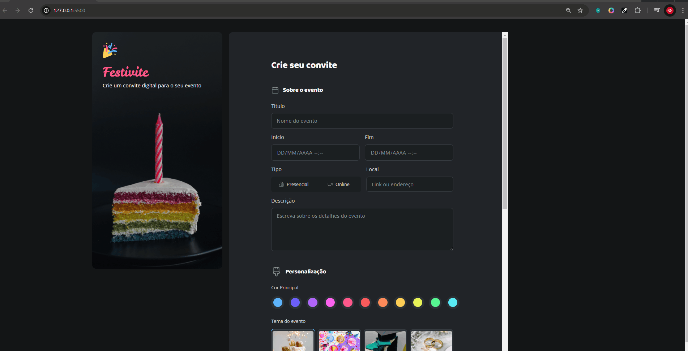

# Formulário de Convite

Este repositório contém um projeto de formulário responsivo para convites, ideal para eventos como casamentos, aniversários e celebrações diversas. O formulário é construído com HTML e CSS, priorizando validação de dados e uma experiência amigável ao usuário.

## Demonstração


## Funcionalidades

- **Responsividade:** Ainda a ajustar para dispositivos móveis de acordo com o avanço do curso.
- **Validação de Dados:** Verifica a entrada de informações como nome, e-mail e mensagens.
- **Estilização Personalizada:** Um design elegante e minimalista.

## Tecnologias Utilizadas

- **HTML5**: Estrutura semântica do formulário.
- **CSS3**: Estilos modernos com foco em responsividade.


## Estrutura do Projeto

```plaintext
/
├── index.html         # Arquivo principal do formulário
├── style.css          # Estilos personalizados
```

## Como Utilizar

1. **Clone este repositório:**
   ```bash
   git clone https://github.com/seu-usuario/formulario-de-convite.git
   ```

2. **Abra o arquivo `index.html`:**
   Basta abrir o arquivo no navegador de sua preferência.

3. **Personalize o projeto:**
   - Edite o arquivo `style.css` para ajustar o design.

## Contribuições

Contribuições são bem-vindas! Sinta-se à vontade para enviar um pull request ou abrir uma issue.

## Licença

Este projeto está licenciado sob a [MIT License](LICENSE).

## Contato

Para dúvidas ou sugestões:
- **Email:** gabrielnunesdev@outlook.com
- **LinkedIn:** [Gabriel Nunes](https://www.linkedin.com/in/gabrielnunes-dev)
